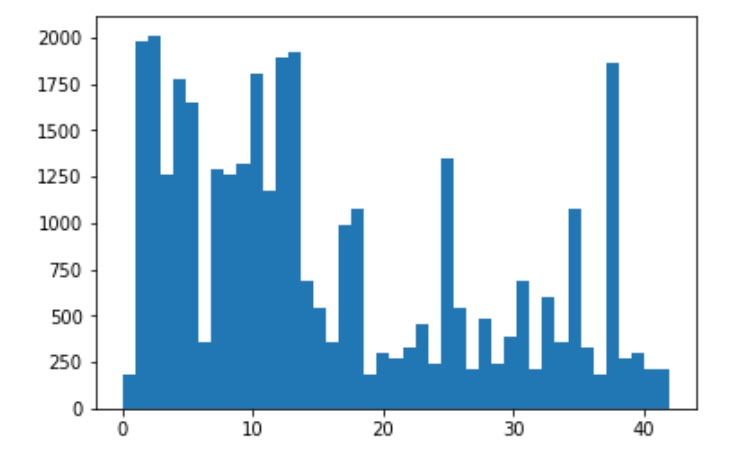
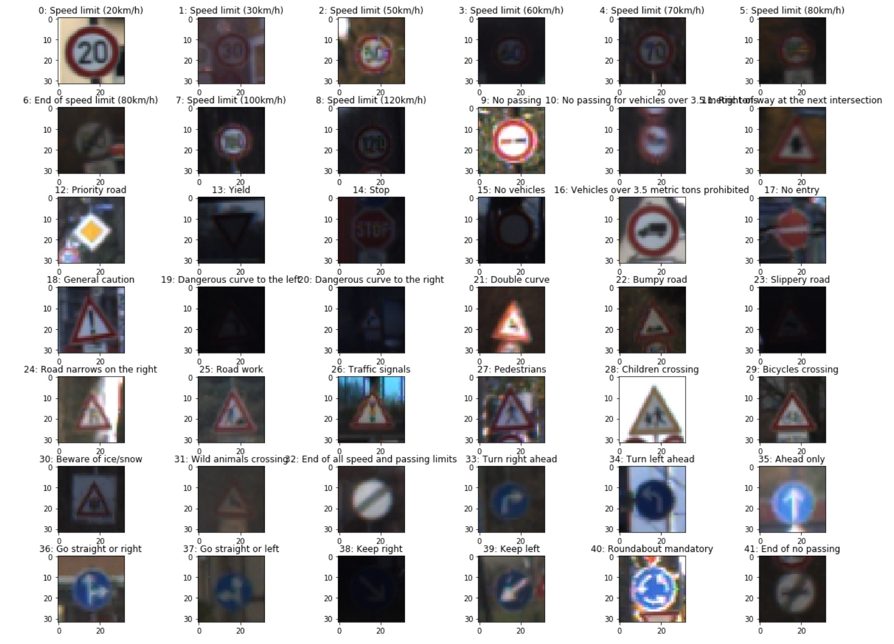
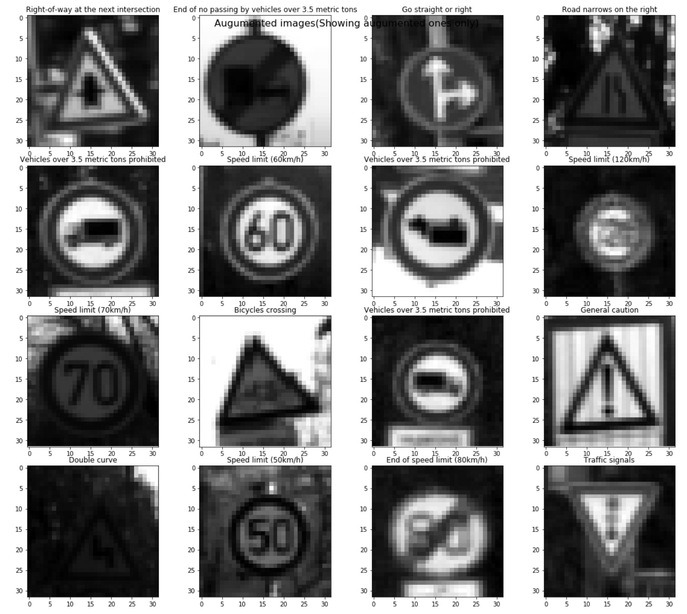
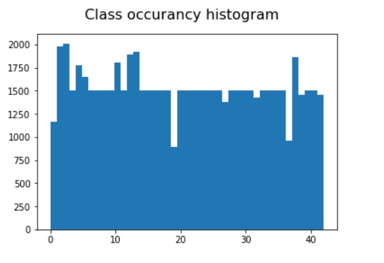
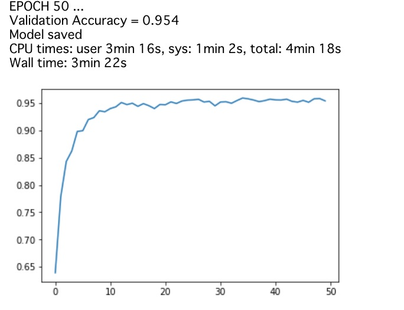
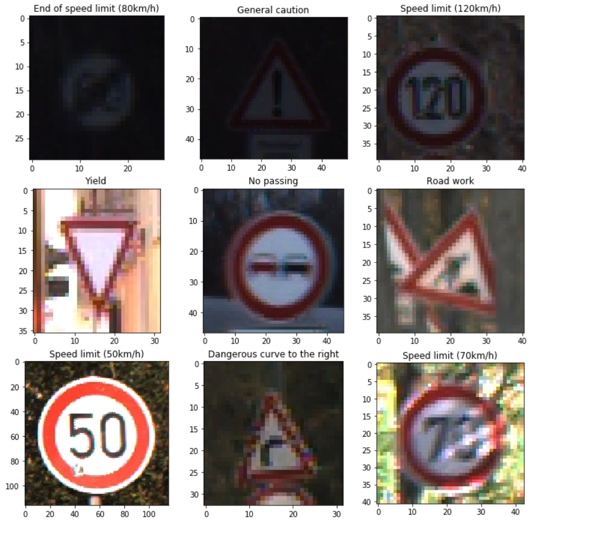
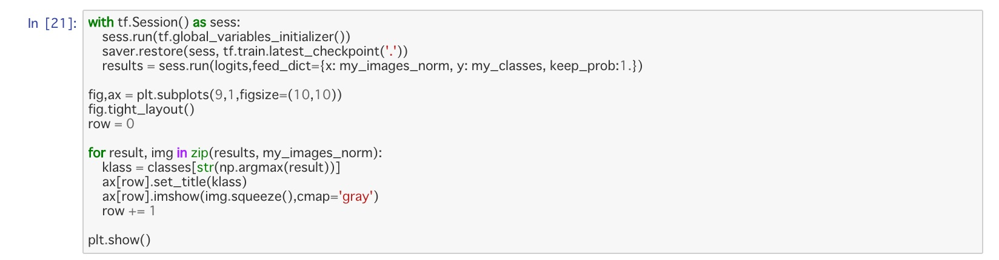
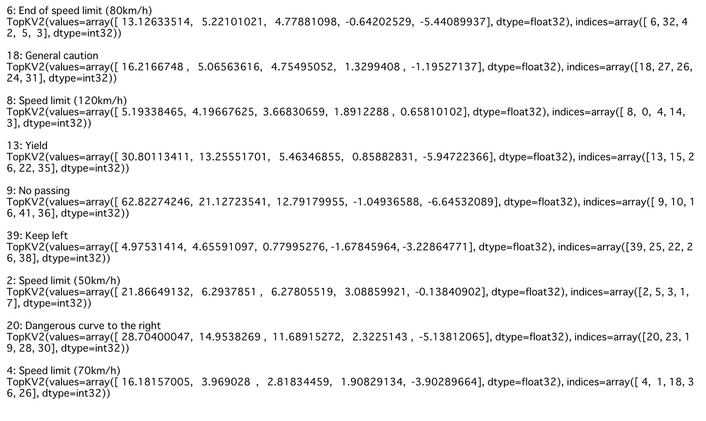

# **Traffic Sign Recognition** 

## Writeup

### You can use this file as a template for your writeup if you want to submit it as a markdown file, but feel free to use some other method and submit a pdf if you prefer.

---

**Build a Traffic Sign Recognition Project**

The goals / steps of this project are the following:
* Load the data set (see below for links to the project data set)
* Explore, summarize and visualize the data set
* Design, train and test a model architecture
* Use the model to make predictions on new images
* Analyze the softmax probabilities of the new images
* Summarize the results with a written report

[//]: # (Image References)

## Rubric Points
### Here I will consider the [rubric points](https://review.udacity.com/#!/rubrics/481/view) individually and describe how I addressed each point in my implementation.  

---
### Writeup / README

#### 1. Provide a Writeup / README that includes all the rubric points and how you addressed each one. You can submit your writeup as markdown or pdf. You can use this template as a guide for writing the report. The submission includes the project code.

You're reading it! and here is a link to my [project code](https://view5f1639b6.udacity-student-workspaces.com/view/CarND-Traffic-Sign-Classifier-Project/Traffic_Sign_Classifier.html)

### Data Set Summary & Exploration

#### 1. Provide a basic summary of the data set. In the code, the analysis should be done using python, numpy and/or pandas methods rather than hardcoding results manually.

I used the pandas library to calculate summary statistics of the traffic
signs data set:

* The size of original training set is 34799
* The size of augmented training set is 65612
* The size of the validation set is 4410
* The size of test set is 12630
* The shape of a traffic sign image is 32x32x3
* The number of unique classes/labels in the data set is 43

#### 2. Include an exploratory visualization of the dataset.

Here is an exploratory visualization of the data set. It is a bar chart showing how the data distributes. We can find that they are so skewed.

Also I walked through example of each classes and found that some of them should not be horizontally flipped. Because if it's flipped then the meaning will be different.

### Design and Test a Model Architecture

#### 1. Describe how you preprocessed the image data. What techniques were chosen and why did you choose these techniques? Consider including images showing the output of each preprocessing technique. Pre-processing refers to techniques such as converting to grayscale, normalization, etc. (OPTIONAL: As described in the "Stand Out Suggestions" part of the rubric, if you generated additional data for training, describe why you decided to generate additional data, how you generated the data, and provide example images of the additional data. Then describe the characteristics of the augmented training set like number of images in the set, number of images for each class, etc.)

I preprocessed input images in the sequence below

1. Grayscale
2. Normalize
3. Augment
   1. Horizontal flip(If it does not matter the meaning even after flipping)
   2. Vertical flip
   3. Random rotation
   4. Random shear
   5. Random shift
   6. Random zoom

Now we have 65612 training examples. Here is the random pickups of them.

You can find that some sings are vertically flipped and rotated at some randomly.

Also I tweaked the ratio of augmentation to normalize the skewed record numbers of each classes. Now 65512 records distributes like below.

From what I have seen the public papers and searched internet around, my training dataset with size of 65612 is rather small but, I decieded to proceed first.

#### 2. Describe what your final model architecture looks like including model type, layers, layer sizes, connectivity, etc.) Consider including a diagram and/or table describing the final model.

My final model consisted of the following layers which is LeNet with Droptout in FC layers:

| Layer         		|     Description	        					| 
|:---------------------:|:---------------------------------------------:| 
| Input         		| 32x32x1 grayscaled image   							| 
| Convolution 5x5    	| 1x1 stride, valid padding, outputs 28x28x6 	|
| RELU					|												|
| Max pooling	      	| 2x2 stride,  outputs 16x16x6 				|
| Convolution 5x5    	| 1x1 stride, valid padding, outputs 10x10x16 	|
| RELU					|												|
| Max pooling	      	| 2x2 stride,  outputs 5x5x16 				|
| Fully connected		| 400 input feature, outputs 120 features with dropout 
| RELU					|												| 
| Fully connected		| 120 input feature, outputs 84 features with dropout 
| RELU					|												|
| Fully connected		| 84 input feature, outputs 43 features     									|
| Softmax				|  									|
 

#### 3. Describe how you trained your model. The discussion can include the type of optimizer, the batch size, number of epochs and any hyperparameters such as learning rate.

I chose parameters below:

- # of training data: 65514
- Learning rate: 0.001
- EPOCH: 50
- Batch size: 128
- Dropout keep probabilities: 0.5

And the curve of validation accuracy looks below. The original LeNet had around 85-88% of validation accurary and it did not change if I changed any parameters. So I introduced dropout in fully connected layers other than the last layer. It improved the accuracy to around 93-95%.

Also I tried to increase the # of training data and it turned out actually it improves slightly. However it also introduce longer training time so I did not take it.

Learning rate and batch size, I took values from the lectures.

#### 4. Describe the approach taken for finding a solution and getting the validation set accuracy to be at least 0.93. Include in the discussion the results on the training, validation and test sets and where in the code these were calculated. Your approach may have been an iterative process, in which case, outline the steps you took to get to the final solution and why you chose those steps. Perhaps your solution involved an already well known implementation or architecture. In this case, discuss why you think the architecture is suitable for the current problem.

My final model results were:
* validation set accuracy of 95.4%
* test set accuracy of 93.4%

If an iterative approach was chosen:
* What was the first architecture that was tried and why was it chosen?
    * I took LeNet because it is well known architecture that is good start point.

* What were some problems with the initial architecture?
    * Validation accuracy ceils around 89% even if we increate num of training data set or num of epochs.

* How was the architecture adjusted and why was it adjusted? Typical adjustments could include choosing a different model architecture, adding or taking away layers (pooling, dropout, convolution, etc), using an activation function or changing the activation function. One common justification for adjusting an architecture would be due to overfitting or underfitting. A high accuracy on the training set but low accuracy on the validation set indicates over fitting; a low accuracy on both sets indicates under fitting.
    * I added dropout to first and second FC layers. It improves validation accuracy to around 95%.

* Which parameters were tuned? How were they adjusted and why?
    * Num of epochs. I started from 10 but as we can see above accuracy curve picture, 10 was not enough to converge.
    * Num of training examples. As I discussed above, I tried more augmentation and the maximum value is around 200K. However it also introduces longer training time. So I finally diceded to make every classes have at least 1500 examples. As a result, we have 65512 examples totally.

* What are some of the important design choices and why were they chosen? For example, why might a convolution layer work well with this problem? How might a dropout layer help with creating a successful model?

If a well known architecture was chosen:
* What architecture was chosen?
    * LeNet

* Why did you believe it would be relevant to the traffic sign application?
    * I was not for sure. However, at the same time I did not have other concrete candidate assumption or architecture, so I used LeNet for startpoint, and it achieved baseline of 93% validation accuracy.

* How does the final model's accuracy on the training, validation and test set provide evidence that the model is working well?
    * It provides 95.4% of validation set accuracy and 93.4% of test set accurcy.
 

### Test a Model on New Images

#### 1. Choose five German traffic signs found on the web and provide them in the report. For each image, discuss what quality or qualities might be difficult to classify.

Here are 9 German traffic signs(actually I took 9 this time) that I found on the web:

The first image might be difficult to classify because ...

#### 2. Discuss the model's predictions on these new traffic signs and compare the results to predicting on the test set. At a minimum, discuss what the predictions were, the accuracy on these new predictions, and compare the accuracy to the accuracy on the test set (OPTIONAL: Discuss the results in more detail as described in the "Stand Out Suggestions" part of the rubric).

Here are the results of the prediction:

| Image			        |     Prediction	        					| 
|:---------------------:|:---------------------------------------------:| 
| End of speed limit (80km/h)      		| End of speed limit (80km/h) 									| 
| General caution     			| General caution 										|
| Spped limit (120km/h) | Spped limit (120km/h) |
| Yield					| Yield											|
| No passing | No passing |
| Roadwork | Keep Left |
| Speed limit (50km/h) | Speed limit (50km/h) |
| Dangerous curve to the right | Dangerous curve to the right |
| Speed limit (70km/h) | Speed limit (70km/h)  |

The model was able to correctly guess 8 of the 9 traffic signs, which gives an accuracy of 88.89%. 

#### 3. Describe how certain the model is when predicting on each of the five new images by looking at the softmax probabilities for each prediction. Provide the top 5 softmax probabilities for each image along with the sign type of each probability. (OPTIONAL: as described in the "Stand Out Suggestions" part of the rubric, visualizations can also be provided such as bar charts)

The code for making predictions on my final model is located in the 121th cell of the Ipython notebook. You can find the screenshot below.

Here is the the top five soft max probabilities. For bad prediction `Keep left` despite `Roadwork`, we can see the confidences are so close amont `Keep left(label: 39)` and `Roadwork(label:25)`.

